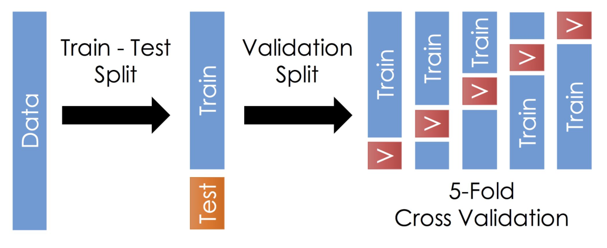

# Entrenamiento

### Conjuntos de entrenamiento y prueba

Partimos el conjunto de datos en dos: una parte la usamos para entrenar al modelo y otra para probar

Una manera es partir de manera que la mayor parte se usa para entrenar el modelo y el retso para probar (ej 80-20, 2/3 y 1/3)

Otra forma es **Cross Validation** (Validacion cruzada)
****Se parte en train y test, y a la parte de train se la divide tambien. Entreno y valido con diferentes particiones y me fijo cual dio mejores resultados y esa particion es la que uso para entrenar.

El train y v es distinto para cada subgrupo

## Conjuntos balanceados

Tenemos que tener en cuenta que los conjuntos esten balanceados. Por ejemplo, si estamos tratando de entrenar un modelo de clasificacion y si tenemos muchos casos de una clase y poco de otra ⇒ es dificil que el modelo se entrene correctamente. Tenemos que tener aprox la misma cantidad de datos para cada clase.

Hay dos tecnicas:

**Undersampling:** quito casos o tomo solo algunos, asi tengo los dos conjuntos con igual cantidad.

**Oversampling:** genero diferentes datasets copiando los datos o copiandolos con modificaciones asi genero la misma cantidad.

## Overfitting

Underfitting: subentrenado. No esta correctamente entrenado. Necesita mas ejemplos, mas tiempo, hay algun problema que hace que el modelo no este ajustando los datos.

Overfitting: sobreentrenado. Cuando ajusta demasiado bien a los datos. Se aprende de memoria los datos, y al agregar algo nuevo, falla. Cuando lo estoy entrenando, con el conjunto de entrenamiento funciona perfectamente 99% de precision, pero al evaluarlo en el test tiene un 60%.

En under esta usando una regresion lineal para un modelo que no tiene una distribucion lineal

## Métricas

Cuando creamos distintos modelos de clasificación (Regresion Logistica, RandomForestClassifier, etc) nos interesa conocer si el modelo esta clasificando correctamente lo que queremos.

Hay distintas metricas que miden cosas distintas que pueden ayudarnos en algunos casos pero en otros pueden confundirnos, por ende *es muy importante tener bien claro que es lo que estamos midiendo*.

- $Precision = \frac{TP}{TP + FP}$
- $Recall =\frac{TP}{TP + FN}$
- $TPR$  sinonimo de Recall  →  (True Positive Rate)
- $FPR = \frac{FP}{FP + TN}$  → (False Positive Rate)
- $ROC$: (Receiver Operating Characteristic)
- $AUC$: Area Under (ROC) Curve

**Ejemplo Moneda**

Hay dos posibilidades: sale cara o sale cruz

| True Positive (TP): Predigo algo que realmente sucede | cara → cara |
| --- | --- |
| False Positive (FP): Predigo algo que no sucede | cara → cruz |
| False Negative (FN): Predigo que no va a pasar y pasa | no cara → cara |
| True Negative (TN): Predigo que no va a pasar y no pasa | no cruz → cara |

Queremos que la cantidad de TP sea la mayor posible, que el modelo siempre sea cierto. La realidad es que eso es muy dificil, entonces vamos a medir que tanto acierta y que tanto se equivoca.

En el ejemplo TP=2  y  FP=3        TPR=2/5  y  FPR=3/5

Se busca que la diagonal sea lo mas grande posible → signfica que me estoy equivocando lo menos posible

$precision = \frac{2}{2+3} = \frac{2}{5}$

$recall = \frac{2}{2+1} = \frac{2}{3}$ 

Observar que punto a punto va cambiando TPR y FPR y lo que nos interesa es la **proporcion**

En el grafico anterior las 3 curvas representan 3 modelos diferentes.el area debajo de la curva ROC

• AUC: Area Under (ROC) Curve 
→ el area debajo de la curva ROC

0.5 < AUC < 1

Sirve para tomar como referencia cque modelo es mejor que otro, que modelo esta acertando mas y funcionando mejor

Algunos modelos tardan mucho en cargar. Por eso, a veces podemos terminar eligiendo un modelo que tal vez no es el mejor, pero demanda menos tiempo computacional. No siempre es conveniente buscar el mejor modelo posible porque puede demandar mayor tiempo o costo computacional.

### **Deteccion de morrones → Clasificacion de la red en azul**

Verdaderos Positivos = 3
Falsos Positivos = 2

Falsos Negativos = 2
Verdaderos Negativos = 3

Precisión = VP / VP + FP = 3 / 5

Recall = VP / VP + FN = 3 / 5