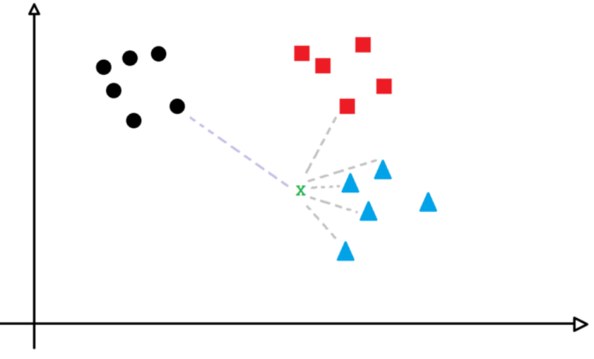

# KNN & SVM

KNN: k-nearest neighbors algorithm
SVM: Support Vector Machines

**Teoricas**

- [ ]  [https://drive.google.com/file/d/1vBJ6q9Lpo0HN3bs3ene5BYCfjwwtda_G/view](https://drive.google.com/file/d/1vBJ6q9Lpo0HN3bs3ene5BYCfjwwtda_G/view)

**Practicas**

- [ ]  KNN: [https://drive.google.com/file/d/1LHy_ZdES_pktg8eJ8mOb-Xjxo3rGWuuN/view](https://drive.google.com/file/d/1LHy_ZdES_pktg8eJ8mOb-Xjxo3rGWuuN/view)
- [ ]  SVM: [https://drive.google.com/file/d/1yDpVUblQWecKi-Zj7IrtKj3LoI-nwg34/view](https://drive.google.com/file/d/1yDpVUblQWecKi-Zj7IrtKj3LoI-nwg34/view)

# **K-nearest neighbors**

**K-vecinos más cercanos**

El algoritmo K-Nearest Neighbors, o simplemente KNN, funciona obteniendo un punto dado y evaluando sus "k" vecinos para encontrar similitudes.

Se puede utilizar para clasificación o regresión → Se usa mayormente para clasificacion

La idea se basa en el hecho de que los puntos de datos similares estarán más cerca en el espacio que los puntos que son muy diferentes entre sí.

Se eligen K vecinos, miramos los vecinos mas cercanos en base a una distancia, cuanta similitud tiene con ese tipo de vecinos para poder inferir de que clase es esa observacion.

Suponemos que si dos puntos son muy cercanos, son muy similares. A distancias mas cortas, mayor va a ser la similitud.

Veamos el siguiente ejemplo. Elijamos el punto X y miremos sus 5 vecinos más cercanos:

Se observa que 4 de esos puntos más cercanos son triángulos y sólo uno es un cuadrado. El "grupo" de círculos está demasiado lejos para ser considerado.

Entonces,según la lógica KNN, podemos concluir que el punto X es un triángulo.

x = df.iloc[:,0:11] → le sacamos el target porque lo usamos para clasificar
y = df.iloc[:,11] → le dejamos el target

Clasificar un tipo de flor en tres posibles subtipos. Para eso tenemos 4 valores: ancho y largo del petalo, y ancho y largo del sepalo

Aparece una nueva observación

¿A qué clase pertenece?
Veamos a su vecino más cercano

Esta nueva observación está más cerca de un verde, entonces es verde

⇒ eso es KNN

¿Pero es suficiente con tomar el vecino más cercano? 

Qué tal si tomamos k vecinos más cercanos. 
Por ejemplo k=7 → Son todos verdes, no cambia nada.

¿Qué pasa si la nueva observación está en otra ubicación?
Usemos esta vez k= 9

5 vecinos verdes
4 vecinos amarillos

⇒ es verde

Aca es una situacion limite, podriamos estar clasificando mal

### Hiperparámetros de KNN

- El valor K
- El tipo de distancia: Euclídea, Manhattan, etc.
- Peso: Los vecinos pueden estar ponderados, siendo que los más cercanos tengan más peso en la votación y los más lejanos menos.
¿Es lo mismo si k=2, que uno de los vecinos esté a 1 cm y el segundo a 2m?

### Problemas

**Conjuntos desbalanceados**

Significa que un conjunto tiene mas o menos la misma cantidad de todas las clases.
Si son dos, seria un 50-50

Por ejemplo: k=9

3 rojos y 6 azules ⇒ es azul

Pero graficamente veo que esta mas cerca del lado rojo que del azul y el punto mas cercano inmediato es rojo. Asi parece que esta nueva observacion es mas bien roja que azul

En estos casos el algoritmo puede fallar 

**Sensible a outliers**

k=3

3 rojos ⇒ es rojo

Pero esos 3 son outliers, podrian ser puntos mal clasificados.

### Resumen:

- Método de clasificación
- Es sensible a conjuntos de datos no balanceados
- Es sensible a outliers
- En scikit-learn, k= 5 por defecto

---

# Support Vector Machines (SVM)

## Dimensionalidad

**XOR: No es linealmente separable**

AND y OR son linealmente separables. Los puedo dividir con una linea.

OR → a o b, donde es T cuando a es T o b es T o ambos son T ⇒ el punto de arriba seria rojo. Para que me queden positivos de un lado y negativos del otro deberia solo trazar la linea de abajo

Con XOR no puede hacer eso porque el valor de arriba es falso. Si ambos T ⇒ es F. Para separarlo necesito dos lineas

No se puede resolver en el plano

Pero si extendemos el plano, nos queda el XOR en 3 dimensiones

Puntos positivos separados en la dimension x3
Y los negativos sobre plano conformado por x1 y x2

Esto si es linealmente separable, lo puedo separar con un hiperplano.

Un problema que no es linealmente separable en un espacio de bajas dimensiones, puede ser linealmente separable en un espacio de alta dimensionailidad.

## Clasificadores basados en el margen, respecto del umbral

**Masa de un puñado de ratones**

Como estoy en una dimension, la linea es un punto solo que separa en dos.

La nueva observacion se considera NO OBESO. Lo mismo ocurre si quedara del otro lado, seria OBESO.

En este caso, si queda cerca del umbral?

Como quedo mas de la derecha, se considera obeso. Pero es realmente obeso?

Poner un umbral tan aleatorio y firme no sirve, no es un buen clasificador.  Como se mejora?

Ahora la nueva observacion se clasifica como no obeso. Veo que la distancia mas corta al prox raton es con los no obesos.

El naranja de ese lado puede ser debido a que tal vez el raton es mas alto, por eso tiene mas masa, pero eso no significa que sea obeso.

El segundo es cuando el modelo esta sobreentrenado. Es muy sensible con el conj de entrenamiento porque aprendio a clasificar hasta predice outliers. Con el conj de prueba falla.

Queremos estar en el caso de arriba. Donde puede clasificar mal algunos datos de entrenamiento, pero al agregar nuevos datos el desempeño es mucho mejor.

Cuando permitimos la clasificación errónea, la distancia entre las observaciones u el umbral se llama: **Soft margin**

→ es un margen que acepta que halla instancias mal clasificadas

¿Cómo sabemos que Soft margin tomar? ¿Por qué el Soft margin 1 es mejor que el Soft margin 2?

El Soft margin, será calculado por el algoritmo que usemos, utilizando validación cruzada.

- Partirá el conjunto en dos (70% - 30%), o a veces en 10 subconjuntos.
- Utilizará pares de observaciones similares para calcular la distancia media del umbral y validar la clasificación con el segundo conjunto.
- Cómo sabe de antemano que va a soportar clasificaciones erróneas, tendrá que definir cuántas soportará en su margen blando y cuantas observaciones.

### En 2D

### E**n 3D**

Masa, altura y edad

Va a tener un plano que divide el espacio y otros dos planos para los margenes.

### E**n 4D**

Masa, altura, edad y presión sanguínea

No es completamente imposible de graficar, pero si es dificil de interpretar

En colores la cuarta dimensión

## Observaciones N-dimensionales

Otro ejemplo:

Los Maximal Margin Classifiers y los Support Vector Classifiers (clasificadores de márgenes blandos) no pueden clasificar problemas que no son linealmente separables.

# Support Vector Machines

Ahora si puedo meter una recta tal que quede el problema separado de forma lineal

La nueva observacion se considera naranja → pertenece a los no curados 

### Idea principal de los SVM:

1. Empezar con observaciones en una dimensión relativamente baja
2. Llevar los datos a una dimensión mayor
3. Encontrar un clasificador de tipo Support Vector que separe los datos en la alta dimensión en 2 grupos.

**¿Por qué elegimos  $y=x^2$ ?**

El algoritmo detrás de Support Vector Machines, usa algo llamado Funciones Kernel que sistemáticamente buscan clasificadores de tipo Support Vector Classifiers en dimensiones más altas.

En el ejemplo anterior usamos un Kernel de tipo Polinómico, el cual toma un parámetro d, para el grado del polinomio

## SVM Kernel polinomico

### d=1

En 1 dimensión computa la relación entre cada par de observaciones, para encontrar el Support Vector Classifier

### d=2

Obtiene una segunda dimensión elevando al cuadrado las observaciones.

Y luego computa la relación entre cada par de observaciones….

Utilizando las relaciones calculadas → Calcula el clasificador: Support Vector Classifier

### d=3

Agregamos a la que ya teníamos una nueva dimensión basada en x^3

Calcula el algoritmo nuevamente las relaciones entre todas las observaciones y busca un plano que parta el conjunto en 2.

Con **d=4**, repite el proceso agregando una dimensión adicional. Lo mismo para cualquier **d=n**.

### En resumen:

1. El Kernel Polinómico de SVM sistemáticamente incrementa las dimensiones seteando d, desde 1 (o el valor base de las observaciones) hasta el valor del parámetro.
2. Calcula en cada caso las relaciones entre las observaciones para encontrar un hiper-plano que parta el conjunto en 2.
3. Usando validación cruzada, en cada caso calcula el error y se queda con el mejor d.

## SVM Kernel Radial (Radial Basis Function Kernel)

Soporta **Support Vector Classifiers** en infinitas dimensiones

Simplificando: **RBFK** funciona como un Nearest Neighbor model, (vecinos más cercanos) ponderado.

## SVM: The Kernel Trick

Las **Kernel Functions**, sólo calculan la relación entre pares de observaciones como si estuviesen en otra dimensión, pero no realizan una verdadera transformación del espacio.

Este truco del Kernel, **reduce la cantidad de tiempo de cómputo necesario** ya que evita toda la matemática relacionada a la transformación del espacio.
Además permite que se realicen los cálculos del Kernel Radial en infinitas dimensiones.