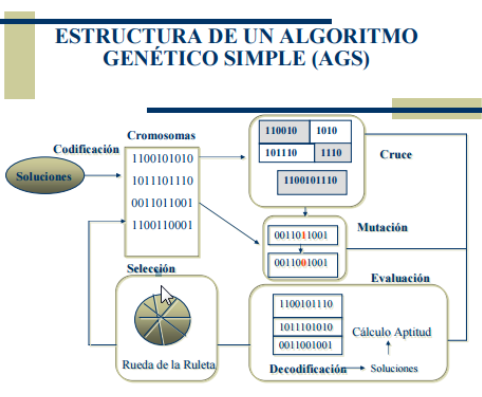

# Algoritmos genéticos

- [ ]  Teorica: [https://drive.google.com/file/d/1rf98P0nj6qmU5TpsPxV6wwvTuyFCE-yp/view](https://drive.google.com/file/d/1rf98P0nj6qmU5TpsPxV6wwvTuyFCE-yp/view)
- [ ]  Practica: [https://drive.google.com/file/d/1C6y9nZdbJrwa-MRqdDR51nVR75ha7qgH/view](https://drive.google.com/file/d/1C6y9nZdbJrwa-MRqdDR51nVR75ha7qgH/view)

**Definiciones:**

- **Fenotipo**: problema a solucionar
- **Cromosoma**: cada una de las soluciones posibles
- **Gen**: cada uno de los símbolos en el cromosoma
- **Genotipo**: si los símbolos son binarios
- **Generación**: cada iteración

Lo primero que tenemos que ver son los crosomas

Existen posibles soluciones a un problema, tal vez no son buenas sino que solucionan de manera aproximada. Esas soluciones las tenemos que codificar de una manera especifica para qe puedan trabajar dentro de esta tecnica. Las codificamos como crosomas, que es cada una de las soluciones posibles

A estos cromosomas les vamos a aplicar ciertas operaciones

1. **Cruce**: intercalar la parte de una solucion con la continuacion de la solucion siguiente y asi generar dos soluciones nuevas 
2. **Mutacion**: cambiar aleatoriamente un gen
3. **Evaluacion**: nos permite probar las soluciones de los crosomas o las que generamos con la mutacion y cruce, y obtener un puntaje, la funcion de aptitud, que tan buena es la solucion y a partir de ahi hacer una solucion que tenga en cuenta este calculo de aptitud y generar un nuevo conjunto de soluciones

### **Variables:**

- Tamaño de la Población
    - Excesiva => lento
    - Escasa => solución poco óptima
- Probabilidad de Cruce (de 0 a 100%)
Prob de que dos sol o crosomas se crucen
- Probabilidad de Mutación (de 0 a 100%)
Proba de que una sol o cromosoma mute

### **Codificaciones:**

- **Codificación binaria**
    - Problema de la mochila 
    (cada elemento está o no)
    
    Tipica para algoritmos geneticos
    

- **Codificación por valor directo**
    - Problema del viajante

Diferentes pesos en cada uno de los elementos

- **Codificación en árbol**
    - El cromosoma es un árbol y la cruza es a nivel de nodos

Cruza → corto una rama de una y de otra y la pego para construir una sol adicional

### **Problema del viajante**

Viajante tiene que recorrer n ciudades y en cada ciudad va a dejando determinada cantidad de producto. Esas ciudades estan distanciadas una de otra. La pregunta es si hay una forma optima de recorrerlas. Lo considerado optimo depende del problema

- Reducir el tiempo: el camino mas rapido para recorrer las n ciudades
- Minimizar costos

Hay a veces alguna condicion mas: una ciudad que tiene que ser visitada primero, otra que no puede ser visitada en ultimo lugar, que tiene que ser visitada en tal horario, ser visitada antes de otra ciudad, etc. 

Solucion algoritmica: construir un grafo ponderado donde cada ciudad representa un nodo y cada arista representa si la ciudad esta o no conectada entre si. La arista esta ponderada (distancia en km, costo, tiempo, etc)

Cuando la catidad de ciudades crece, la complejidad del problema es exponencial. Encontrar ppor fuerza bruta todas las combinaciones de la ruta optima, en algun momento se hace tan grande y complejo que ninguna computadora puede resolverlo. Entonces se plantean para resolverlo heurisicas.

Heuristicas: metodos que tienden a encontrar una solucion suficientemente buena, pero no me garantizan que sea optima.

Los algoritmos geneticos sirven para resolver estos tipos de problemas.

## **Selección**

- **Por Ruleta/Rango**:
    - A cada cromosoma se le asigna una probabilidad según su utilidad y se le asigna una porción de la ruleta. Luego se tira la ruleta y se queda el cromosoma que ganó.

Si tenemos un grafico de torta, cada solucion va a a tener una porcion de la torta segun su utilidad. Se la hace girar, segun donde caiga es el metodo que se elige. Las mejores soluciones tienen mayor probabilidad de ser elegidas.

- **Selección elitista**:
    - Igual que el anterior pero además copiamos a los mejores en la siguiente generación para que no se pierdan en caso de no salir en la ruleta.

Ej: tenemos una sol buena con el 60% del total de la ruleta, pero no sale al tirar ⇒ la copiamos a mano.

- **Otras selecciones:**
    - jerárquica → hay un orden
    - por torneo → se hace competir a las sol
    - escalada, etc.

## Cruza

### **Crossover 1 Punto**

Agarro 2 soluciones y corto en un punto al azar. Pego parte de una solucion en la otra, hago lo mismo con la otra parte y tengo dos soluciones nuevas. 

### **Crossover 2 Puntos**

Aca cortamos dos veces

### **Crossover aritmetico o asimetrico?**

Se pueden cortar en diferentes puntos los padres para formar hijos

## **Mutación**

- Consiste en cambiar aleatoriamente un gen
- No se debe abusar
Tienen que ser pocas las mutaciones, porque sino la solucion no va a converger a nada coherente.

# **Ejemplo de Algoritmo genético sencillo:**

**Sea X el problema a resolver.**

Las soluciones están representadas como tira de bits.

1. Comenzar con una población **P** generada aleatoriamente de **n** cromosomas de **k**  bits.

2. Calcular la *aptitud* **f(x)** para cada cromosoma **x** de **P**.

3. Repetir los siguientes pasos hasta que se hayan creado **n** descendientes:

a. Seleccionar un par de cromosomas de **P**, siendo la probabilidad de selección una función creciente de la *aptitud*.
Vamos a seleccionar dos cromosomas y los vamos a cruzar segun la probabilidad. Idealmente esa prob va a depender de la aptitud, si son aptos es mas probable que se crucen.

a1. Con probabilidad **pc** (probabilidad de cruce), cruzar el par en un punto elegido aleatoriamente para formar dos descendientes. 

(Si no tiene lugar ningún cruce, formar dos descendientes que sean copias exactas de sus respectivos padres) y agregarlos a una nueva población **P’**

a2. Mutar los dos descendientes en cada lugar con probabilidad **pm** (probabilidad de mutación) y colocar los cromosomas resultantes en la nueva población **P’**.

b. Si **n** es impar, se puede rechazar aleatoriamente a un miembro de la nueva población.

4. Reemplazar la población actual **P** con la nueva **P’**.

5. Volver al paso 2.

# **Problema de la mochila**

Hay una probabilidad de hacer cruza y una prob de hacer mutacion. Son prob diferentes entre si. La de mutacion en gral es mucho mas chica.

**Repetimos, hasta obtener 4 elementos en la población**

> La funcion de aptitud es una funcion que devuelve un valor en un rango. Cuanto mas alto, mejor.
En el caso de las reinas son las colisiones, y cuanto mas bajo mejor
>